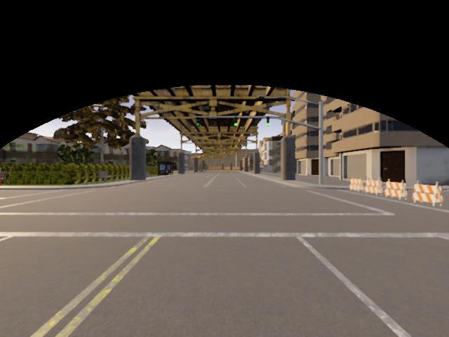

# View ROI Filter

The view ROI filter applies a static mask on the input image topic and publishes this filtered image topic.
The image content that is removed by the mask is usually not required for driving and therefore reduces the bitrate required for encoding the image content.
The filter mask dynamically changes based on vehicle odometry provided by the status topic.



## Usage

```shell
roslaunch view_roi_filter view_roi_filter_mask.launch

# Launch Arguments
camera_view      # Name of the camera view
image_topic      # Input image topic
status_topic     # Odometry topic for dynamically updating the mask
center_offset    # Static offset for side facing cameras (range between -1 and 1)
block_based_mode # Apply a block based image mask for improved compression efficiency
```

## Evaluation

### Prepare to Record the Output

in `/catkin_ws_teleop/src/view-adaptation/view_roi_filter/bagfiles`, run:

```shell
rosbag record -O cross_left_sun_roi /filter/front/view_roi_filter/carla/ego_vehicle/camera/front/image # <output_bag_name> <output_topic>
```

### Publish the steering angle

1. Open the 2nd terminal, run `rqt`;
1. Select Plugins \to Topics \to Message Publisher;
1. Set Topics: /carla/ego_vehicle/vehicle_status
       Freq.: 20
       steer: cos(pi*i/80)

### Run the Filter Node

Open the 3rd terminal, in `/catkin_ws_teleop`, run:

```shell
roslaunch view_roi_filter view_roi_filter_mask.launch # image_topic:=<image_topic> status_topic:=<status_topic> center_offset:=<center_offset> block_based_mode:=<true or false>
```

### Replay the Rosbag

Open the 4th terminal, in the `bagfiles` folder and run:

```shell
# rosbag info <input_bag>
rosbag play cross_left_sun.bag # <input_bag>
```

## Extract Videos from Rosbags and Evaluate the Quality

```shell
./evaluation.sh /carla/ego_vehicle/camera/front/image cross_left_sun # <image_topic> <bag_name> <reference_bitrate>
```
